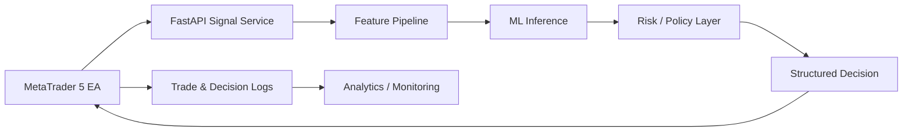

# NEXORA Trading Engine — Architecture

This repository is a sanitized engineering showcase derived from the broader NEXORA trading research system.

## Full-system architecture

## Separation of concerns

### MT5 integration
Handles broker-side communication and execution. The complete EA implementation is private.

### Signal service
The full system uses a FastAPI service as the boundary between trading-side requests and Python inference/risk components. The active implementation is private; its architecture is documented publicly.

### ML layer
The research system experiments with engineered market features and LightGBM-based inference. Model weights, training datasets, exact feature formulas and training recipes are private.

### Risk and policy layer
Prediction does not automatically imply execution. A separate policy layer evaluates whether a candidate signal is permitted under current risk/context constraints. Exact thresholds and rules are private.

### Analytics
Selected analytics/reporting modules are intentionally public because they demonstrate Python, Pandas, data analysis and engineering practices without revealing the active trading strategy.

## Repository safety boundary

**Public:** selected analytics, safe utilities, architecture, project documentation, testing/configuration guidance and model/data governance documentation.

**Private:** active signal/execution code, proprietary scoring logic, exact strategy thresholds, detailed risk formulas, complete EA implementation, model artifacts, raw market datasets, credentials and private trading logs.

## Status

Research/demo only. NEXORA is not presented as a guaranteed-profit or audited production trading system.
