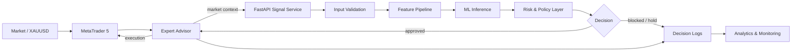
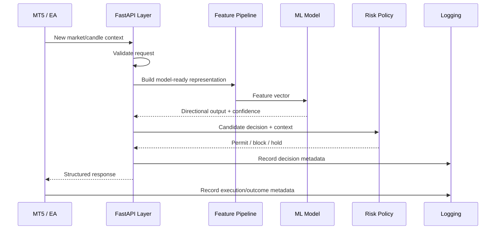
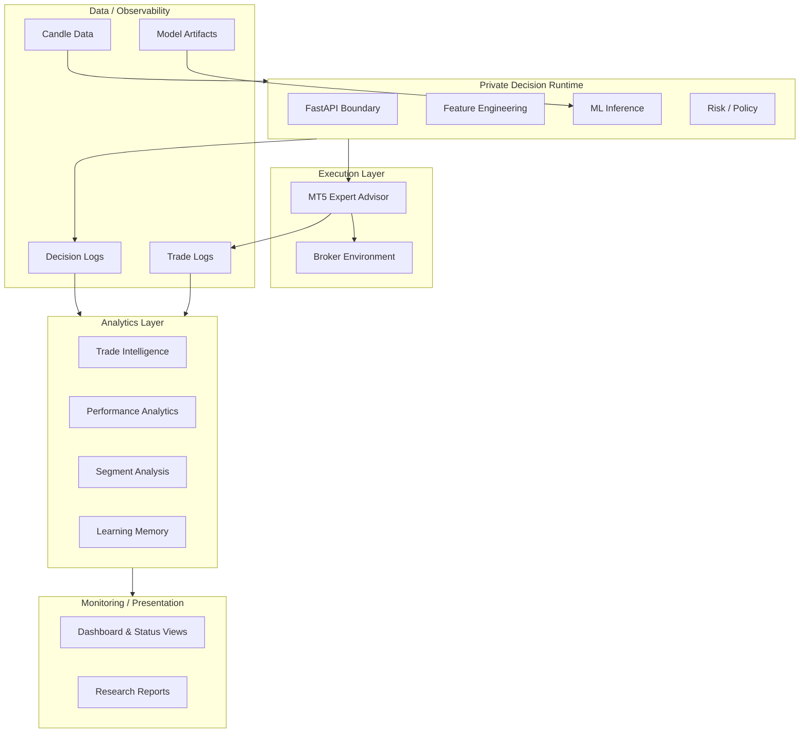
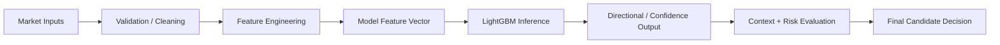
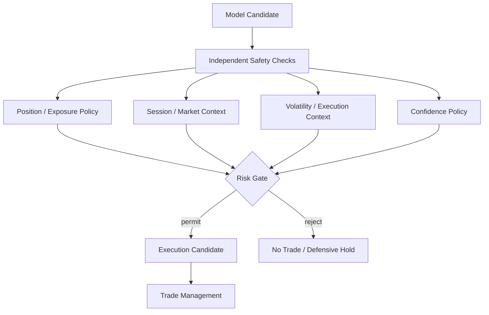
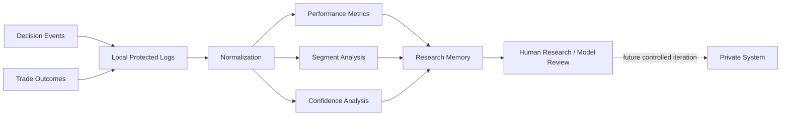
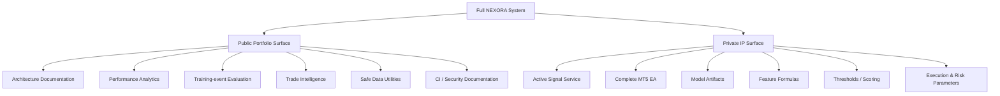

# NEXORA Trading Engine — Architecture

NEXORA is an AI-assisted systematic-trading research platform. The full system connects MetaTrader 5 to a Python/FastAPI intelligence layer, machine-learning inference, independent risk controls, execution management, logging and offline analytics.

This public repository documents the architecture while intentionally withholding proprietary implementation details.

## 1. System overview

The active EA, signal service, model artifacts, proprietary features and policy thresholds remain private.

## 2. Request-to-decision lifecycle

This separation is intentional: **model prediction is not equivalent to permission to trade**.

## 3. Layered design

## 4. Machine-learning boundary

The research system uses engineered market/candle information and has experimented with LightGBM for directional modeling and confidence scoring.

Public documentation intentionally stops at the component/interface level. Feature definitions, training recipes, fitted weights and decision thresholds are private.

## 5. Risk architecture

A central design principle is that the ML model proposes information; a separate safety layer controls whether that information can become an execution candidate.

Exact parameter values and active rules are not published.

## 6. Observability and analytics loop

NEXORA records decisions and outcomes so behavior can be investigated rather than treated as a black box.

The public `learning_memory.py` should be understood as an **analysis feedback mechanism**, not an autonomous system that rewrites live strategy code.

## 7. Public versus private architecture

## 8. Failure-safety philosophy

The architecture favors conservative failure behavior:

- malformed or unavailable inputs should not silently become trade approvals;
- missing model/context information should degrade toward HOLD/no-trade behavior;
- prediction and execution remain separated;
- risk controls should not be bypassed merely to increase trade frequency;
- runtime decisions should leave enough metadata for investigation;
- model/data artifacts and credentials are kept outside public source control.

## 9. Technology map

| Area | Technology / approach |
|---|---|
| Language | Python |
| API architecture | FastAPI / REST |
| ML research | LightGBM, feature engineering, confidence analysis |
| Trading integration | MetaTrader 5 / Expert Advisor architecture |
| Data analysis | Pandas, NumPy |
| Research instrument | XAUUSD |
| Primary research timeframe | M5 |
| Environment | Windows + WSL/Ubuntu workflow |
| Packaging/deployment research | Docker |
| Observability | Structured decision/trade logs + analytics |
| Source control | Git / GitHub |

## 10. Architectural status

The system is an active research project undergoing validation and forward-testing. The architecture is designed to support progressively stronger testing, backtesting, observability and deployment practices, but the project is **not presented as an audited production trading platform or as having guaranteed profitability**.

For repository-level details, see `PROJECT_STRUCTURE.md`. For the rationale and development scope, see `PROJECT_CONTEXT.md`.
