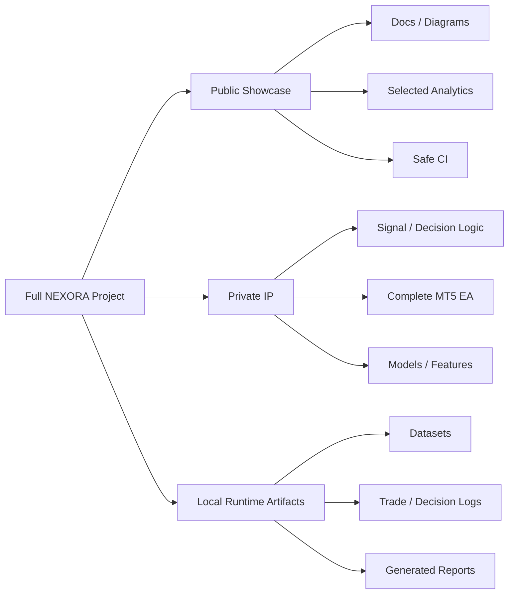

# Excluded Files & Private Components

NEXORA's public repository is deliberately **not** the complete trading system. It is a portfolio-safe engineering surface designed to show architecture, Python/data skills and development discipline without publishing the active strategy.

## Boundary at a glance

## Explicitly excluded

### Runtime data
- `data/`
- raw and historical candle datasets
- generated training-event datasets
- feature matrices
- backtest/forward-test exports

### Models
- `models/`
- `*.pkl`
- `*.joblib`
- runtime model metadata that reveals private feature/configuration details

### Logs and generated analytics
- `logs/`
- `ai_trade_log.csv`
- `ai_decision_log.csv`
- generated analytics reports
- local performance summaries

### Proprietary implementation
- active FastAPI signal-server implementation
- complete MQL5 Expert Advisor strategy implementation
- feature-engineering formulas used by the active model
- model-training recipes that reproduce active behavior
- tuned confidence/scoring thresholds
- session/regime decision rules
- detailed risk formulas and SL/TP parameterization
- execution overrides and final strategy-fusion logic

### Secrets and local environment
- `.env` and environment-specific secrets
- broker/account credentials
- API tokens and keys
- local virtual environments
- cache/build artifacts
- backups and local repository snapshots

## Why useful code remains public

A recruiter should still be able to inspect real engineering work. Selected analytics remain because they demonstrate:

- Python/Pandas/NumPy usage;
- defensive data loading and normalization;
- performance metric calculation;
- forward-return and directional evaluation;
- confidence and segment analysis;
- structured reporting;
- modular code organization.

Those skills are visible without revealing the rules that decide actual trades.

## Historical note

Some sensitive implementation existed in earlier public development history before the repository was converted into a sanitized showcase. Current `main` is the maintained public boundary. Git history requires separate sanitization if complete removal from historical commits is required, and previously cloned public history cannot be revoked.

## See also

- `MODEL_AND_DATA_POLICY.md`
- `ARCHITECTURE.md`
- `PROJECT_STRUCTURE.md`
- `SECURITY.md`
- `LICENSE`
