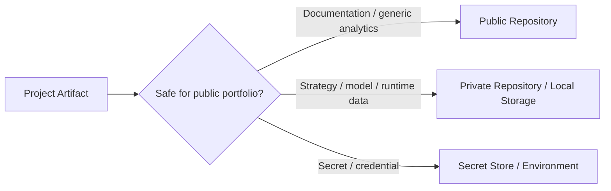
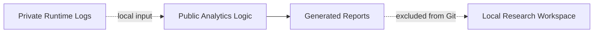

# NEXORA — Model, Data & Intellectual-Property Policy

This public repository is a **sanitized engineering showcase**, not a reproducible distribution of the complete NEXORA trading system.

The policy exists for three reasons: protect credentials/private data, prevent accidental publication of proprietary trading logic, and keep the repository useful to technical reviewers without making the active system clonable.

## Classification model

## Public-safe material

The public repository may contain:

- high-level architecture and component diagrams;
- selected analytics/reporting code;
- generic data-cleaning and evaluation utilities;
- sanitized configuration examples;
- testing and CI definitions that do not contact brokers;
- documentation of technology choices and engineering principles;
- model/data interface descriptions that do not reveal active formulas or weights.

## Private model material

The following are not intended for public source control:

- fitted `.pkl` / `.joblib` model binaries;
- active model metadata when it exposes the feature set or runtime configuration;
- training recipes that reproduce proprietary strategy behavior;
- exact model/ensemble thresholds;
- calibration or decision rules used by the active system;
- private evaluation outputs that reveal strategy performance or behavior in excessive detail.

## Private data

Excluded data includes:

- raw/historical market datasets used by the active project;
- locally collected candle logs;
- trade logs and decision logs;
- account/broker exports;
- generated feature datasets;
- training-event datasets;
- private backtest/forward-test artifacts;
- any dataset containing account identifiers or operational information.

The `.gitignore` excludes broad runtime artifact classes including `data/`, `models/`, `logs/`, CSV/Parquet data and serialized model formats.

## Proprietary strategy boundary

The public repository should not contain enough information to reconstruct the active strategy. Keep private:

- exact feature-engineering formulas used by the active model;
- decision-fusion/scoring algorithms;
- confidence gates and tuned thresholds;
- session/regime scoring rules;
- detailed position-sizing rules;
- exact stop-loss/take-profit parameterization;
- execution overrides;
- complete Expert Advisor strategy implementation;
- active signal-server decision logic.

## Credentials and secrets

Never commit:

- broker usernames/passwords;
- API tokens;
- private keys;
- webhook secrets;
- database credentials;
- real session/authentication secrets;
- `.env` files containing operational values.

Use environment variables or an appropriate secrets provider for operational deployments.

## Public analytics philosophy

Analytics can be public when they demonstrate transferable engineering skills without encoding the strategy itself. Examples include generic P&L aggregation, drawdown calculation, confidence-distribution analysis, segmented evaluation and report generation.

The logic can therefore be reviewed while the underlying operational data remains private.

## Repository review checklist

Before publishing a new file, verify that it contains none of the following:

- secret values or account identifiers;
- model binaries or private datasets;
- tuned trading thresholds;
- active execution rules;
- private broker paths/configuration containing personal information;
- proprietary formulas that materially reproduce the strategy;
- generated logs or reports that should remain local.

## Git-history warning

Removing a sensitive file from the current branch does **not** guarantee that earlier public commits no longer contain it. History sanitization is a separate operation and prior public clones cannot be revoked. This repository should therefore be treated as having had earlier development history, while the current branch is maintained as the sanitized portfolio surface.

## Licensing

This repository is **All Rights Reserved**. Public visibility is provided for portfolio/review purposes and does not grant permission to copy, redistribute or modify the source. See `LICENSE` for the repository terms.
