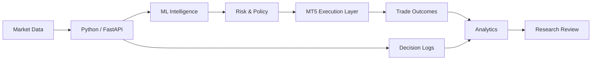
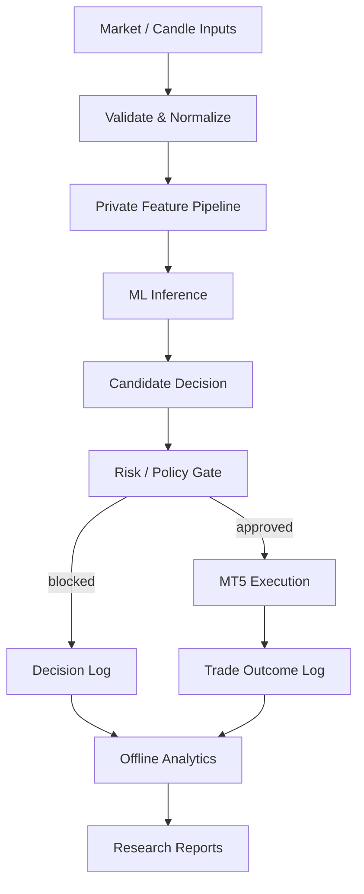
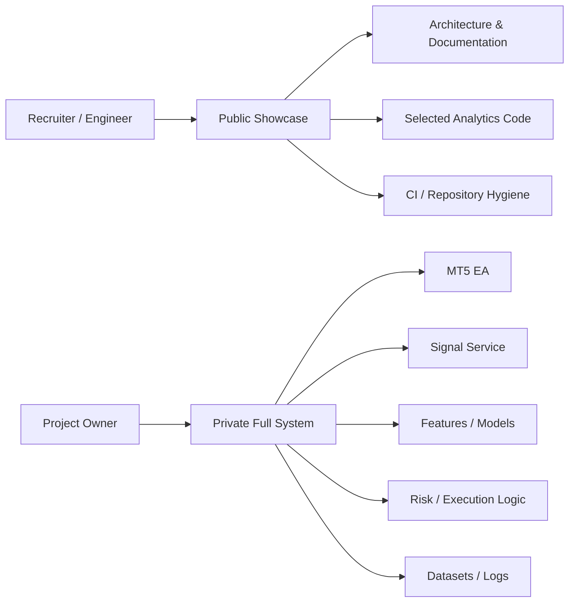

# NEXORA Trading Engine — Project Context

## Executive summary

NEXORA is an independent AI-assisted algorithmic-trading research platform created to explore how machine learning, backend services, risk engineering, MetaTrader 5 integration and data analytics can be combined into a modular decision system.

The project is intentionally approached as an **engineering and research problem**, not as a promise of guaranteed trading returns. The emphasis is on measurable behavior, explainability, defensive controls, data quality and iterative validation.

This repository is the public portfolio surface of a larger private codebase. It contains enough implementation and documentation to demonstrate technical capability while withholding components that would expose proprietary trading logic.

## Problem being explored

A trading model cannot be evaluated only by asking whether it outputs BUY or SELL. A useful system also needs to answer:

- Was the input data valid?
- How confident was the model?
- Under what market/session context was the decision made?
- Should a prediction be allowed to become a trade?
- What happened after the decision?
- Which conditions repeatedly produce weak or strong outcomes?
- Can the behavior be explained and audited later?

NEXORA was structured around these questions.

## System concept

## Full project layers

### 1. MetaTrader 5 integration

The full private project includes an MT5 Expert Advisor that communicates with the Python intelligence layer. It is responsible for trading-platform integration, broker-side execution and trade-management behavior.

### 2. FastAPI service layer

A Python/FastAPI service forms the interface between MT5 and the ML/risk components. Its responsibilities include request validation, orchestration, structured responses, health/status behavior and logging.

The active implementation is private because it historically contained strategy and execution-sensitive logic.

### 3. Machine-learning research

NEXORA experiments with supervised directional modeling using engineered market/candle features. LightGBM has been used in the research workflow, with confidence information incorporated into later analysis and decision gating.

The public repository does not publish the active feature formulas, fitted model artifacts, model metadata or exact training recipe.

### 4. Independent risk/policy layer

A key architectural principle is:

> **Prediction ≠ permission to trade.**

The system separates model inference from risk and execution policy. The broader research explores controls such as exposure/position sizing, stop-loss/take-profit handling, maximum concurrent positions, session restrictions and defensive no-trade behavior.

Exact parameterization is private.

### 5. Observability and analytics

Decision and trade metadata are analyzed after the fact using Python/Pandas workflows. Public analytics modules demonstrate:

- P&L and trade-outcome aggregation;
- win/loss statistics;
- drawdown/performance calculations;
- confidence distributions;
- directional hit-rate analysis;
- forward-return evaluation;
- segmentation by time/session/context;
- decision-reason analysis;
- structured research reports.

### 6. Research feedback

Historical decisions and outcomes can be transformed into reports that help identify patterns worth investigating. This is currently a **human-reviewed research feedback loop**, not a claim that the public project autonomously retrains and deploys itself.

## Research scope

| Property | Current scope |
|---|---|
| Primary instrument | XAUUSD |
| Primary timeframe | M5 |
| Trading platform | MetaTrader 5 |
| Backend language | Python |
| API architecture | FastAPI |
| ML experimentation | LightGBM + engineered market features |
| Analysis | Pandas / NumPy |
| Environment | Windows with WSL/Ubuntu workflow |
| Containerization research | Docker |
| Status | Active R&D / validation / forward testing |

## Engineering objectives

NEXORA is designed around the following objectives:

1. **Modularity** — keep data, inference, risk, execution and analytics responsibilities separated.
2. **Explainability** — log why decisions are accepted, blocked or held where possible.
3. **Defensive behavior** — uncertainty or missing dependencies should not silently increase risk.
4. **Measurability** — use outcomes and segmented analytics rather than relying on anecdotal trades.
5. **Reproducibility** — maintain deterministic data-processing/reporting steps where practical.
6. **IP security** — separate portfolio evidence from active proprietary strategy implementation.
7. **Deployment readiness over time** — improve testing, configuration, observability and containerization before considering stronger deployment claims.

## Data lifecycle

## Validation philosophy

A model can look acceptable in aggregate while behaving poorly in specific contexts. For that reason, the public analytics code includes segmentation and forward-return analysis rather than only headline accuracy.

Research questions include:

- Do BUY and SELL decisions behave differently?
- Does confidence correlate with better outcomes?
- Are results concentrated in particular sessions or time windows?
- Are blocked decisions informative?
- Are improvements stable across enough observations?

No public performance metric is presented as proof of future profitability.

## Safety principles

The project explicitly avoids designing around uncontrolled risk escalation. The engineering philosophy rejects martingale/grid-recovery behavior as a shortcut for masking weak signals. Risk controls should remain independent and visible, and increasing trade frequency is not treated as an objective by itself.

## Public portfolio boundary

### Public

- selected Python analytics;
- architecture and system-design documentation;
- safe data utility code;
- CI/repository hygiene;
- testing, configuration and security documentation;
- high-level ML/risk interfaces and concepts.

### Private

- complete MQL5 EA implementation;
- active FastAPI signal server;
- fitted model binaries;
- private datasets and logs;
- proprietary feature formulas;
- exact thresholds and scoring rules;
- detailed risk and execution parameterization;
- broker credentials and account information.

## AI-assisted development

Modern AI coding tools may be used during implementation, debugging, documentation and review. They are treated as development accelerators. Project architecture, integration choices, validation, testing decisions and ownership remain with the author.

## Current maturity

NEXORA should be viewed as a substantial independent engineering project under active development—not a finished commercial trading product. The system has evolved through multiple phases of data collection, ML experimentation, API/MT5 integration, risk controls, logging, dashboard work and analytics.

Current priorities emphasize stronger validation, cleaner portfolio/public boundaries, better testing and observability, and disciplined research before any broader deployment claim.

## Portfolio relevance

The project demonstrates transferable engineering skills beyond trading:

- Python application development;
- REST/API architecture;
- machine-learning integration;
- data cleaning and analytical pipelines;
- time-series/market-data handling;
- defensive software design;
- observability and structured logging;
- modular architecture;
- technical documentation;
- Git/GitHub repository hygiene;
- privacy/IP-aware engineering decisions.

See `ARCHITECTURE.md` for detailed diagrams and `PROJECT_STRUCTURE.md` for a file-by-file recruiter reading guide.
