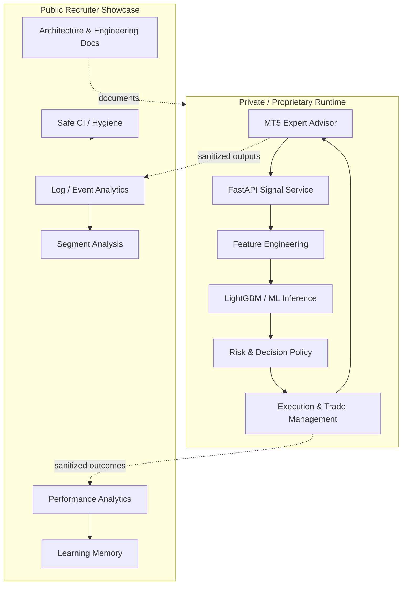
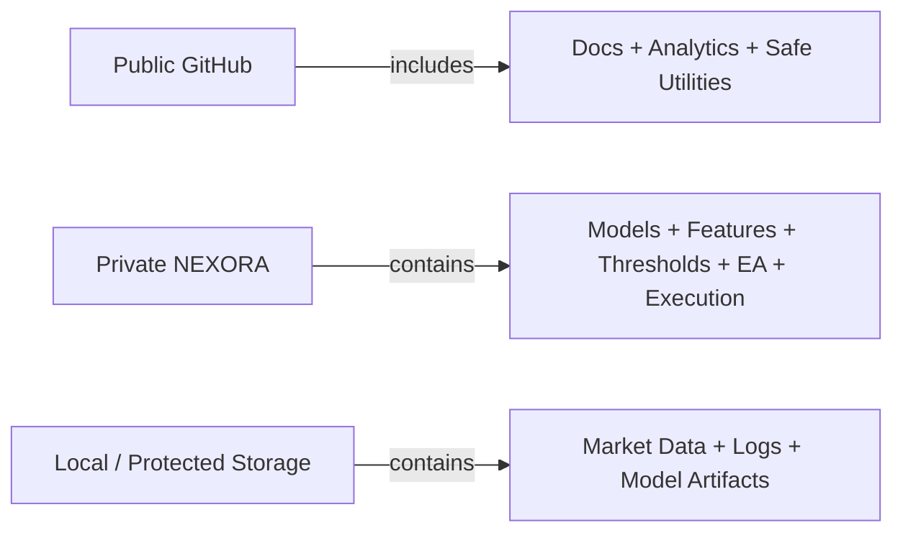

# NEXORA Trading Engine — Project Structure

This document explains both the **public portfolio repository** and where each public component fits into the larger private NEXORA architecture.

> The public repository is intentionally sanitized. It demonstrates engineering depth without publishing model weights, datasets, strategy thresholds, execution logic or credentials.

## Repository map

```text
nexora-trading-engine/
├── .github/
│   ├── workflows/                 # Safe CI / repository hygiene
│   ├── ISSUE_TEMPLATE/            # Structured issue reporting
│   ├── CODEOWNERS
│   └── dependabot.yml
│
├── analytics/
│   ├── analyze_segments.py        # Segment-level validation analytics
│   ├── analyze_training_events.py # Offline event/model evaluation
│   ├── learning_memory.py         # Outcome + decision-memory reporting
│   ├── performance_analytics_engine.py
│   ├── performance_tracker.py
│   └── trade_intelligence.py
│
├── tools/
│   └── merge_history.py           # Local candle-history merge utility
│
├── docs/media/                    # Portfolio media / architecture assets
│
├── README.md                      # Recruiter-facing project overview
├── ARCHITECTURE.md                # System design and data-flow diagrams
├── PROJECT_CONTEXT.md             # Goals, scope and engineering decisions
├── PROJECT_STRUCTURE.md           # This repository map
├── MODEL_AND_DATA_POLICY.md       # Model/data/IP boundary
├── EXCLUDED_FILES.md              # What is deliberately not public
├── CONFIGURATION.md               # Safe local configuration guidance
├── TESTING.md                     # Validation strategy
├── SECURITY.md                    # Security and disclosure policy
├── ROADMAP.md                     # Research/development direction
├── KNOWN_ISSUES.md                # Honest limitations
├── CHANGELOG.md                   # Public-showcase evolution
├── LICENSE                        # All Rights Reserved
└── .gitignore                     # Prevents runtime/private artifacts
```

## How the public code maps to the full system



The dotted lines represent conceptual interfaces. Runtime datasets and private trade logs are **not committed**.

## Analytics package

### `analyze_training_events.py`
Offline validation of decision/training events. It demonstrates Pandas/NumPy processing, schema-tolerant analytics, forward-return analysis, confidence grouping and directional hit-rate evaluation.

### `analyze_segments.py`
Breaks evaluation data into interpretable segments such as time, confidence bucket, signal class and session flags. This supports the research principle that aggregate performance alone is not enough; behavior should be inspected across market/context slices.

### `trade_intelligence.py`
Produces descriptive statistics from trade and decision logs, including P&L summaries, win/loss counts, confidence distributions and decision-reason analysis.

### `performance_tracker.py`
Tracks outcome-level statistics and generates reusable performance summaries. It demonstrates defensive file handling and reporting rather than proprietary entry/exit rules.

### `performance_analytics_engine.py`
The most comprehensive public analytics module. It normalizes runtime logs, computes performance metrics and groups results for deeper evaluation. Strategy-generation logic is intentionally absent.

### `learning_memory.py`
Transforms historical outcomes and decision metadata into structured reports that can inform future research. This is an analytics feedback mechanism—not an autonomous live self-learning system.

## Tools

### `merge_history.py`
A small local data-engineering utility for combining historical and newly collected candle data, deduplicating records and preserving chronological order. Raw market data remains excluded.

## Documentation layer

The documentation is deliberately substantial because the active trading implementation is private. Recruiters can still evaluate system thinking, component boundaries, safety decisions, testing philosophy and the relationship between ML, APIs, execution and analytics.

## What is intentionally absent



Not published:

- active FastAPI signal-server implementation;
- complete MQL5 Expert Advisor;
- trained model binaries and model metadata used by runtime;
- raw/historical datasets and private logs;
- proprietary feature formulas;
- exact confidence/scoring thresholds;
- detailed SL/TP and position-sizing parameterization;
- execution overrides and final decision rules;
- broker/account credentials.

## Recruiter reading path

For a fast technical review, read in this order:

1. `README.md` — what NEXORA is and the technologies involved.
2. `ARCHITECTURE.md` — how the full system is designed.
3. `analytics/performance_analytics_engine.py` — deeper Python/data-analysis evidence.
4. `analytics/analyze_training_events.py` — ML evaluation workflow.
5. `analytics/trade_intelligence.py` — readable analytics/reporting code.
6. `MODEL_AND_DATA_POLICY.md` — why sensitive artifacts are deliberately absent.
7. `TESTING.md` and `.github/workflows/` — engineering hygiene.

This structure is designed to provide meaningful engineering evidence while maintaining a clear intellectual-property boundary.
