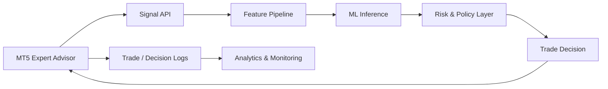

# NEXORA Trading Engine

**Author: Ashwin Thakoor**

NEXORA is an independent AI-assisted algorithmic-trading research project built around Python, machine learning, MetaTrader 5 integration, risk controls, and trading analytics.

This repository is a **recruiter-safe engineering showcase**. It intentionally excludes proprietary strategy rules, trained model artifacts, private datasets, credentials, exact decision thresholds, execution logic, and other components that could reveal the full trading system.

> Research/demo software only. This repository is not financial advice and is not presented as a proven profitable or production trading system.

## What this project demonstrates

- Python-based quantitative/trading analytics
- Machine-learning signal architecture
- MetaTrader 5 integration architecture
- FastAPI-based signal-service architecture in the private/full system
- Trade and decision-log analysis with Pandas
- Performance reporting and confidence analysis
- Risk-management architecture and safety-first design
- Modular separation between inference, execution, analytics, monitoring, and data
- Ongoing experimentation and validation before live deployment

## High-level architecture

The diagram documents the complete system at an architectural level. Sensitive implementation details behind the signal, feature, risk, and execution layers are intentionally not published here.

## Public showcase components

The public repository focuses on safe-to-share engineering evidence such as:

- analytics and reporting utilities;
- trade/performance analysis;
- confidence and decision-log analysis;
- dashboard/monitoring support where safe to expose;
- project architecture and engineering documentation;
- model/data governance documentation;
- configuration, testing, security and project-structure documentation.

## Technologies used in the full project

`Python` · `FastAPI` · `Pandas` · `NumPy` · `LightGBM` · `MetaTrader 5` · `REST APIs` · `Docker` · `WSL/Ubuntu`

The primary research workflow has focused on **XAUUSD** using **M5 market data**, with higher-timeframe context and explicit risk controls.

## ML workflow

At a high level, the private/full NEXORA system follows this workflow:

1. Receive or collect market/candle data.
2. Validate and transform market inputs.
3. Build engineered features.
4. Run ML inference.
5. Evaluate confidence and market/risk context.
6. Apply safety and trade-policy controls.
7. Return an actionable or no-trade decision.
8. Record decisions and outcomes for later analysis and model improvement.

Exact feature formulas, thresholds, model artifacts, training recipes and decision rules are deliberately excluded from the public repository.

## Risk engineering

Risk management is treated as a separate layer from model prediction. The full project explores controls including position sizing, stop-loss/take-profit handling, maximum concurrent trades, session restrictions and defensive no-trade behavior.

The public repository documents these capabilities without publishing the proprietary parameterization used by the private research system.

## Analytics

Public analytics code demonstrates practical Python/Pandas work around trading and decision logs, including:

- trade outcome aggregation;
- win/loss and P&L statistics;
- confidence distributions;
- decision-reason analysis;
- performance summaries;
- structured report generation.

These components are intentionally separated from the private trading strategy.

## Repository boundary

### Public here

Architecture, selected analytics, documentation, safe utilities and portfolio evidence.

### Kept private

- trained `.pkl` model artifacts;
- raw/historical market datasets;
- broker/account credentials and API secrets;
- exact feature-engineering formulas used by the active system;
- proprietary scoring and confidence thresholds;
- execution/override logic;
- detailed risk parameterization;
- complete MT5 Expert Advisor strategy implementation;
- private trade and decision logs.

## Project status

NEXORA is under active research and development. Work includes model experimentation, analytics, risk controls, backtesting/forward-testing workflows and system architecture improvements. Claims of guaranteed profitability are intentionally avoided.

## Security and IP

No credentials, private datasets or trained model artifacts should be committed to this repository. See `SECURITY.md` and `MODEL_AND_DATA_POLICY.md` for repository boundaries.

## License

**Copyright 2026 NEXORA / Ashwin Thakoor. All Rights Reserved.**

The source code, documentation and assets in this repository may not be copied, redistributed or modified without prior written permission. See `LICENSE` for the repository terms.
