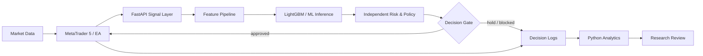
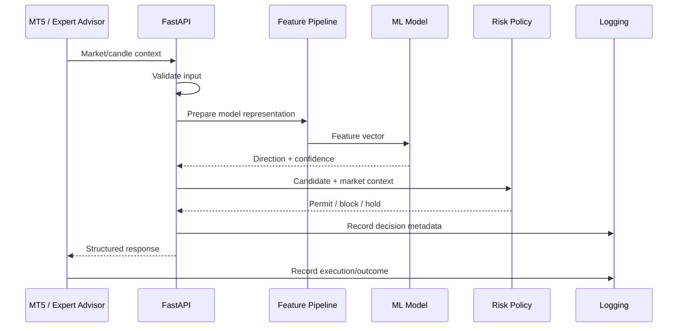
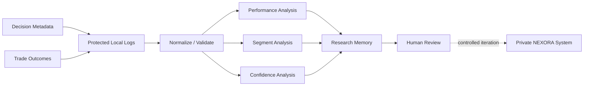
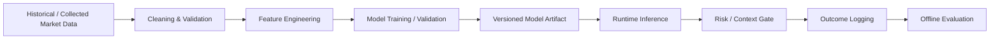
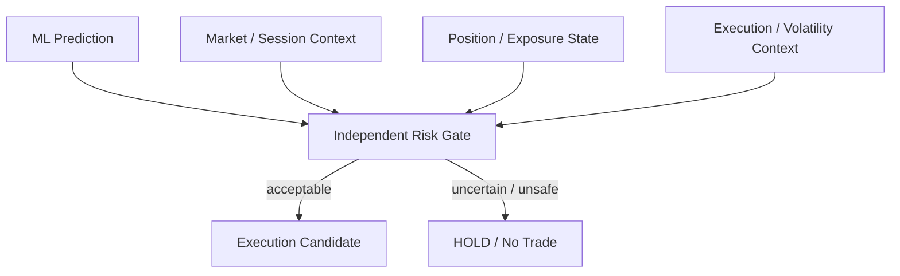
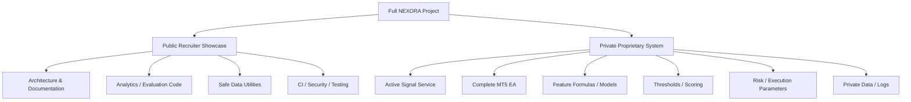

# NEXORA AI — Trading Intelligence Engine

### Machine Learning · FastAPI Architecture · MetaTrader 5 · Quantitative Analytics · Risk Engineering

**Independent engineering project by Ashwin Thakoor**

*An AI-assisted systematic-trading research platform connecting market data, machine-learning inference, independent risk controls, MT5 execution architecture and post-trade analytics.*

---

## Overview

NEXORA is an independent AI/ML and backend-engineering project built to investigate a difficult systems question:

> **How can an ML prediction be transformed into a controlled, explainable and measurable trading decision without treating the model as an unquestioned black box?**

The full private system combines Python, FastAPI, LightGBM research, MetaTrader 5 integration, structured logging, risk controls and analytics. This public repository is a **sanitized technical showcase**: it contains real analytics code and detailed system documentation while intentionally excluding proprietary strategy implementation, trained models, private datasets, credentials and exact trading thresholds.

> **Research software — not financial advice.** NEXORA is under active validation and is not presented as a guaranteed-profit or audited production trading system.

---

## Architecture at a glance

The active implementation behind the feature, model, risk and execution layers remains private. See [`ARCHITECTURE.md`](ARCHITECTURE.md) for deeper sequence, data-flow, risk and observability diagrams.

---

## Engineering highlights

| Area | Evidence in the project |
|---|---|
| **Python engineering** | Modular analytics, file normalization, reporting, utilities and backend architecture |
| **Machine learning** | LightGBM-based directional-model research, confidence analysis and evaluation workflows |
| **Backend / APIs** | FastAPI signal-service architecture connecting Python intelligence with MT5 |
| **Data analysis** | Pandas/NumPy workflows for P&L, forward returns, hit rate, confidence and segmentation |
| **Trading integration** | MetaTrader 5 Expert Advisor ↔ Python service architecture |
| **Risk engineering** | Prediction separated from trade permission; defensive policy layer and no-trade behavior |
| **Observability** | Decision/trade logging, blocked-reason analysis, performance reports and research feedback |
| **Dev environment** | Git/GitHub, Windows, WSL/Ubuntu workflow and Docker experimentation |
| **Documentation** | Architecture, project context, testing, security, configuration, roadmap and IP/data policy |

---

## What happens to a market event?

A core principle of NEXORA is that **prediction is not permission**. A model output is only one input to a broader risk-aware decision process.

---

## Public code worth reviewing

### `analytics/performance_analytics_engine.py`
A larger performance-analysis module that demonstrates defensive log discovery/loading, schema normalization, metric calculation and grouped analysis. It is useful evidence of practical Python/data work without exposing entry logic.

### `analytics/analyze_training_events.py`
Offline evaluation workflow for decision/training events. It examines signal distributions, forward returns, confidence buckets, session context and directional hit rates.

### `analytics/analyze_segments.py`
Slices model/decision behavior across contextual segments to investigate whether apparent performance is concentrated in particular conditions rather than trusting a single aggregate number.

### `analytics/trade_intelligence.py`
Readable trade/decision analysis including P&L summaries, win/loss statistics, confidence distributions and decision-reason reporting.

### `analytics/performance_tracker.py`
Outcome-oriented tracking and reporting utilities, including win/loss metrics and drawdown-style analysis.

### `analytics/learning_memory.py`
Transforms historical decision/outcome metadata into structured research summaries. It supports human-reviewed iteration; it is **not** represented as an autonomous production self-learning engine.

### `tools/merge_history.py`
A small data-engineering utility that merges local candle-history sources, deduplicates records and preserves chronological ordering. Raw market data is excluded from Git.

---

## Analytics feedback loop

This design makes model/system behavior inspectable after decisions occur.

---

## ML research workflow

The private/full research workflow follows a conventional supervised-learning lifecycle while keeping the tuned implementation private:

Public code demonstrates the evaluation/analytics side. The repository intentionally does **not** publish fitted model binaries, private training datasets, exact feature formulas, training recipes or tuned decision thresholds.

---

## Risk-first design

The broader project explores position sizing, stop-loss/take-profit management, maximum concurrent positions, session restrictions and defensive behavior. Exact parameterization remains private.

---

## Repository design: evidence without giving away the strategy

### Intentionally private

- complete MT5 Expert Advisor strategy implementation;
- active FastAPI signal/decision server;
- trained `.pkl` / `.joblib` models;
- raw/historical market datasets and private logs;
- proprietary feature formulas;
- exact confidence/scoring thresholds;
- detailed SL/TP and position-sizing rules;
- execution overrides and final decision-fusion logic;
- broker/account credentials.

See [`MODEL_AND_DATA_POLICY.md`](MODEL_AND_DATA_POLICY.md) and [`EXCLUDED_FILES.md`](EXCLUDED_FILES.md).

---

## Technology stack

**Core**  
Python · FastAPI · Pandas · NumPy · LightGBM · REST APIs

**Trading / Data**  
MetaTrader 5 · XAUUSD · M5 time-series/candle data · structured trade/decision logs

**Engineering**  
Git · GitHub · WSL/Ubuntu · Docker experimentation · CI hygiene

---

## Research scope and status

| Item | Current public description |
|---|---|
| Instrument | XAUUSD |
| Primary timeframe | M5 |
| Style | Intraday AI-assisted systematic-trading research |
| ML | LightGBM experimentation + confidence/evaluation workflows |
| Backend | Python/FastAPI architecture |
| Execution | MetaTrader 5 integration architecture |
| Validation | Offline analytics + forward-testing/research workflow |
| Deployment | Development/research stage; not claimed as audited production |

NEXORA prioritizes **quality of evidence over frequency of trades**. A lack of trading activity is not automatically treated as a defect if safety/quality gates reject weak conditions.

---

## Documentation map

| Document | Purpose |
|---|---|
| [`ARCHITECTURE.md`](ARCHITECTURE.md) | Detailed architecture, sequence, risk and data-flow diagrams |
| [`PROJECT_CONTEXT.md`](PROJECT_CONTEXT.md) | Problem statement, scope, engineering principles and maturity |
| [`PROJECT_STRUCTURE.md`](PROJECT_STRUCTURE.md) | File-by-file repository map and recruiter reading path |
| [`MODEL_AND_DATA_POLICY.md`](MODEL_AND_DATA_POLICY.md) | Public/private model, data and IP boundary |
| [`EXCLUDED_FILES.md`](EXCLUDED_FILES.md) | Explicit list of intentionally private artifacts |
| [`TESTING.md`](TESTING.md) | Safe validation philosophy |
| [`SECURITY.md`](SECURITY.md) | Security expectations and disclosure guidance |
| [`ROADMAP.md`](ROADMAP.md) | Research/development direction |
| [`KNOWN_ISSUES.md`](KNOWN_ISSUES.md) | Honest limitations |

---

## Suggested recruiter review — 5 minutes

1. Read this overview.
2. Open [`ARCHITECTURE.md`](ARCHITECTURE.md) for system-design depth.
3. Review `analytics/performance_analytics_engine.py` for substantial Python/data-analysis code.
4. Review `analytics/analyze_training_events.py` for ML evaluation thinking.
5. Review `analytics/trade_intelligence.py` for clear reporting/analytics implementation.
6. Read [`MODEL_AND_DATA_POLICY.md`](MODEL_AND_DATA_POLICY.md) to understand why the actual strategy/model artifacts are intentionally absent.

---

## Engineering principles

- **Fail safely** when required information is missing or uncertain.
- **Separate prediction from execution permission.**
- **Measure outcomes**, not just model outputs.
- **Log decisions** so behavior can be investigated.
- **Avoid uncontrolled risk escalation** such as martingale/grid-recovery shortcuts.
- **Protect IP and credentials** while still providing credible portfolio evidence.
- **Do not claim profitability without sufficient validated evidence.**

---

## License & intellectual property

**Copyright 2026 NEXORA / Ashwin Thakoor. All Rights Reserved.**

This repository is publicly visible for technical/portfolio review. Public visibility does not grant permission to copy, redistribute or modify its source, documentation or assets. See [`LICENSE`](LICENSE).

---

### NEXORA
**Machine Learning × Backend Engineering × Data Analytics × Risk Systems**

*Built as an independent long-term engineering and research project.*

